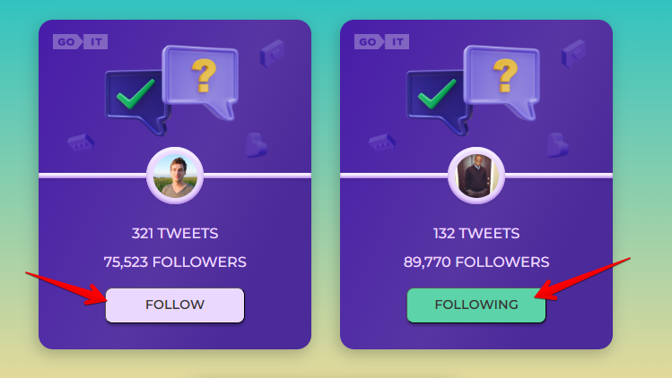
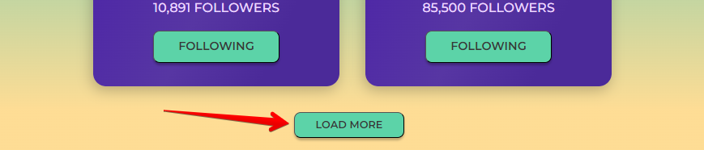

# Tweets App

Це репозиторій для мого проекту Tweets App. Тут зберігається код, документація
та інші важливі ресурси. Цей проект було створено за допомогою Create React App.

Для знайомства та налаштування додаткових можливостей
[звернутися до документації](https://facebook.github.io/create-react-app/docs/getting-started).

Tweets App дозволяє переглядати інформацію кількості твітів та підписників у
деяких користувачів. Також можливо підписуватись та відписуватись від
користувачів. При клікові на кнопку Follow - текст змінюється на Following.
Також змінюється колір кнопки, а до кількості фоловерів додаєтесь і Ви. При
оновленні сторінки кількіст фоловерів та стан кнопки залишається як до
оновлення.

У проекті є зручна навігація по сторінкам та кнопка "Back" яка повертає на
домашню сторінку.

Також працює пагінація. При натиснанні на кнопку "Load more" підзавантажуються
ще три картки користувачів.

Демо відео роботи застосунку можна переглянути за
[посиланням](https://monosnap.com/file/c2UNx3vc5rziGndwQGviPzVIsBjqHe)

## Встановлення

1. Склонуйте репозиторій:
   `git clone https://github.com/your-username/your-repo.git`
2. Перейдіть до директорії проекту: `cd your-repo`
3. Виконайте установку залежностей: `npm install`

## Використання

1. Запустіть програму: `npm start`
2. Відкрийте браузер і перейдіть за адресою: `http://localhost:3000`
3. Насолоджуйтесь проектом!

## Внесення змін

Якщо ви хочете внести свій внесок до проекту, будь ласка, дотримуйтесь наступних
кроків:

1. Створіть гілку для своїх змін: `git checkout -b ваша-гілка`
2. Внесіть необхідні зміни в код.
3. Зробіть коміт зі своїми змінами: `git commit -m "Опис змін"`
4. Запуште коміт у віддалений репозиторій: `git push origin ваша-гілка`
5. Відкрийте пул-реквест на GitHub.
